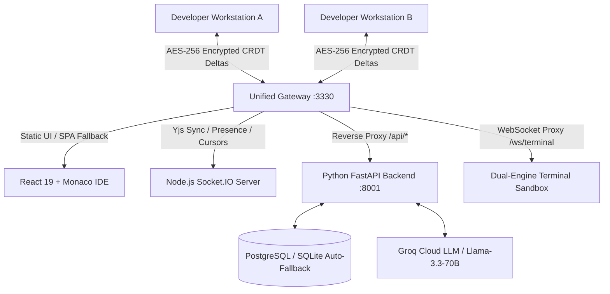

# Nulltor: Secure LAN Collaborative IDE & Version Control Platform
## Comprehensive Architectural Abstract & Technical Specification Document

---

## 1. Executive Summary & Vision

**Nulltor** is an enterprise-grade, peer-to-peer collaborative development environment and localized version control platform designed to operate seamlessly over local area networks (LAN) or air-gapped enterprise environments. It fuses the real-time collaborative editing experience of **VS Code** with the branch governance, code reviews, and audit trails of **GitHub**, combined with an autonomous **AI Software Engineering Agent**.

Nulltor ensures 100% data sovereignty and zero-trust security: code snapshots and CRDT synchronization deltas are encrypted client-side using military-grade cryptography (**AES-256-GCM**) before transmission, ensuring that the central node or server remains completely blind to plain source code.



---

## 2. Core Functional Modules & Capabilities

### 2.1 Real-Time Collaborative IDE & Comms
* **Monaco Editor Engine**: Full-featured code editing powered by the Monaco Editor engine (the core of VS Code) with syntax highlighting for JavaScript, TypeScript, Python, HTML, CSS, Rust, Go, SQL, C/C++, and Markdown.
* **CRDT Document Synchronization (Yjs)**: Conflict-free Replicated Data Type (CRDT) engine ensuring zero-conflict, sub-millisecond concurrent multi-cursor editing across LAN peers.
* **Live Remote Cursor & Presence Tracking**: Real-time visualization of active collaborators, user color badges, line/column tracking, and peer presence broadcasts.
* **Integrated WebRTC Video/Audio Calling**: Built-in peer-to-peer encrypted mesh video chat for instant team communication without external tools. Uses native `RTCPeerConnection` for 100% data sovereignty (no external media servers like Twilio or Jitsi).

### 2.2 Local Version Control & Branch Governance
* **Multi-Branch Hierarchy**:
  * `main`: Canonical shared room for synchronized team development.
  * `subroom`: Parallel collaborative team branch for feature development.
  * `private`: Zero-Knowledge developer isolation vault for private experiments.
* **GitHub-Style Branch Pull & Sync**:
  * 1-click **`Pull / Sync`** action allowing developers on subrooms or private branches to pull latest changes from `main` (or other branches).
  * Path-hierarchy reconciliation automatically creates missing directory structures and files.
  * Auto-generates sync commit records (`⬇ Sync: Pulled updates from 'main'`).
* **Decentralized PR Governance (GitHub Model)**:
  * **Open Review Visibility**: All project members can inspect open merge requests.
  * **Branch-Scoped Authority**: Any project member on `main` can review and accept PRs into `main`. Subroom members can review and accept PRs into their respective subrooms without admin bottlenecks.
  * **Connected Commits**: Integrates branch commit history with PR submission, auto-populating titles and descriptions from recent commits.
  * **Automatic Merge Commits**: Confirmed merges generate merge commit timeline records (`🔀 Merge: <PR Title>`).
* **Monaco Side-by-Side Diff Viewer**:
  * Full-screen side-by-side diff review with line-by-line additions/deletions.
  * Correct visual orientation: **Current Working Code (Left)** vs **Target Revision / Incoming Code (Right)**.
  * 1-click **"Pull & Apply"** and **"Confirm & Merge"** directly from inside the diff modal.
* **Commit History & Revision Rollbacks**:
  * Encrypted snapshot timeline with commit messages, author metadata, timestamps, and instant 1-click rollback/revert.

### 2.3 Merge Conflict Detection & Resolution Strategy

Nulltor implements a hybrid **4-Layer Conflict Resolution Architecture**:

```
 ┌─────────────────────────────────────────────────────────────┐
 │  Layer 1: Real-Time CRDT Character Convergence (Yjs)        │
 ├─────────────────────────────────────────────────────────────┤
 │  Layer 2: Timestamp & Vector-Based Macro Conflict Detection │
 ├─────────────────────────────────────────────────────────────┤
 │  Layer 3: Visual Side-by-Side Monaco Diff & Conflict Review │
 ├─────────────────────────────────────────────────────────────┤
 │  Layer 4: Pre-Merge "Pull & Sync" Local Resolution (Rebase) │
 └─────────────────────────────────────────────────────────────┘
```

1. **Layer 1: Real-Time CRDT Character Convergence (Yjs)**:
   * During live multi-developer sessions, character-level edits, cursor insertions, and deletions converge mathematically using Yjs CRDT update vectors. No file locks or server-side race conditions exist.
2. **Layer 2: Timestamp & Vector-Based Macro Conflict Detection**:
   * When an asynchronous Merge Request is reviewed, the platform checks if the target branch (`main`) was modified *after* the PR was submitted (`target_updated_at > mr_created_at`).
   * If newer changes are detected, a **Conflict Warning Dialog** alerts the reviewer, preventing accidental overwrites.
3. **Layer 3: Visual Side-by-Side Monaco Diff Inspection**:
   * Reviewers can open the Monaco Diff Viewer directly from the review panel to inspect additions (green) and deletions/modifications (red) side-by-side between the target branch and the incoming PR snapshot.
4. **Layer 4: Pre-Merge "Pull & Sync" Local Resolution (Git Rebase Pattern)**:
   * If `main` has advanced with new changes, the subroom developer can click **`⬇ Pull / Sync`** to pull the latest `main` code into their subroom first.
   * The developer can test, resolve differences in their live Monaco editor, and submit a clean, conflict-free PR into `main`.

### 2.4 Autonomous AI Software Engineering Agent
* **ReAct Agentic Loop**: Multi-turn reasoning and tool execution loop powered by high-speed inference engines (e.g., `openai/gpt-oss-120b` via OpenAI-compatible endpoints or Groq).
* **Direct Workspace Tooling**:
  * `create_file`: Autonomously registers new database file nodes, updates directory trees, opens dedicated editor tabs, and injects code.
  * `write_code_to_file`: Directly modifies workspace files and propagates updates into Monaco and Yjs without requiring manual copy-pasting.
  * `read_active_file` & `list_workspace_files`: Inspects contextual codebase files for accurate edits.

### 2.5 Zero-Trust Client-Side Cryptography (E2EE)
* **Key Derivation (PBKDF2)**: Derives 256-bit symmetric encryption keys using PBKDF2 with SHA-256 and 100,000 iterations over a user-defined project passphrase.
* **Authenticated Encryption (AES-GCM)**: All Yjs deltas, file snapshots, and commit revisions are encrypted client-side with 12-byte initialization vectors (IVs) and authentication tags.

### 2.6 Dual-Engine Interactive Terminal & Code Sandbox
* **Interactive Terminal (xterm.js)**: Full-duplex WebSocket PTY streaming terminal outputs, standard input (`stdin`), and ANSI color escapes.
* **Interactive Input Support**: Seamlessly executes programs requiring dynamic user input (e.g. Python `input()`) over WebSockets.
* **Docker Container Isolation (Engine 1)**: When Docker is installed, user code runs inside isolated, disposable containers (`python:3.11-alpine`, `node:20-alpine`) to prevent malicious system access.
* **Host Process Fallback (Engine 2)**: When Docker is not installed, it automatically falls back to local Python/Node execution via `pywinpty` with zero setup required.

### 2.7 Dual Database Architecture
* **Enterprise PostgreSQL**: Full relational structure with ACID guarantees for production enterprise servers.
* **Zero-Setup SQLite Fallback**: Automatic failover to local SQLite (`backend/nulltor.db`) if PostgreSQL is not running.

---

## 3. Technology Stack & Library Breakdown

### 3.1 Frontend Web Application

| Library / Package | Version | Purpose & Architectural Rationale |
| :--- | :--- | :--- |
| **React** | `^19.0.0` | Declarative component framework providing reactive UI rendering and virtual DOM performance. |
| **TypeScript** | `~5.7.2` | Static type safety across all API interfaces, state models, and editor components. |
| **Vite** | `^6.2.0` | Ultra-fast build tool and bundler featuring instant Hot Module Replacement (HMR). |
| **@monaco-editor/react** | `^4.7.0` | Embeds the VS Code Monaco editor engine into the React DOM with custom theme support. |
| **yjs** | `^13.6.23` | High-performance CRDT framework that manages shared document state and generates delta updates. |
| **socket.io-client** | `^4.8.1` | Manages real-time bidirectional WebSocket transport with automatic reconnection and room subscriptions. |
| **lucide-react** | `^0.475.0` | Crisp SVG icon system replacing all emojis with professional developer UI icons. |
| **zustand** | `^5.0.3` | Lightweight, unopinionated state management for auth state, active files, tabs, and project models. |
| **axios** | `^1.7.9` | Promise-based HTTP client for authenticated REST API calls with request/response interceptors. |
| **@xterm/xterm** | `^5.5.0` | High-performance terminal emulator in the browser for live code execution output and interaction. |
| **@xterm/addon-fit** | `^0.8.0` | Dynamically resizes xterm.js dimensions to fit container dimensions and PTY columns/rows. |
| **diff-match-patch** | `^1.0.5` | Computes character and line-level diffs for the visual side-by-side Merge Request Diff Viewer. |
| **react-router-dom** | `^7.2.0` | Client-side routing for Dashboard, IDE, User Governance, Audit Logs, and Profile views. |
| **Native WebRTC** | `ES6` | `RTCPeerConnection` and `getUserMedia` for peer-to-peer, E2EE mesh video/audio communication without central media servers. |

---

### 3.2 Node.js Unified Gateway & Real-Time Sync Server

| Library / Package | Version | Purpose & Architectural Rationale |
| :--- | :--- | :--- |
| **Express** | `^5.2.1` | Web server framework hosting static React assets, zero-cache headers, SPA routing, and reverse proxies. |
| **socket.io** | `^4.8.3` | WebSocket coordination server managing real-time peer presence, Yjs deltas, and cursor rooms. |
| **http-proxy-middleware** | `^4.2.0` | Reverse proxy routing `/api/*` and `/ws/*` requests to the Python FastAPI backend on a single port. |
| **concurrently** | `^10.0.5` | Orchestrates multi-process execution (FastAPI backend + Node gateway) from a single command. |
| **pg** | `^8.22.0` | Non-blocking PostgreSQL client for Node.js used to store and retrieve encrypted Yjs snapshots. |
| **sqlite3** | `^6.0.1` | Embedded SQLite database driver used for zero-configuration snapshot persistence when PostgreSQL is absent. |
| **dotenv** | `^16.6.1` | Loads environment variables from root `.env` into `process.env`. |
| **@noble/ciphers** | `^2.2.0` | Audited, pure-JS cryptographic library for AES and ChaCha implementations. |
| **@noble/hashes** | `^2.2.0` | Pure-JS implementations of SHA-2, SHA-3, and PBKDF2 hash algorithms. |

---

### 3.3 Python FastAPI Backend & Autonomous AI Service

| Library / Package | Version | Purpose & Architectural Rationale |
| :--- | :--- | :--- |
| **FastAPI** | `>=0.104.0` | Modern, high-performance async web framework powering all REST endpoints and OpenAPI/Swagger docs. |
| **uvicorn** | `>=0.24.0` | Lightning-fast ASGI web server implementation based on `uvloop` and `httptools`. |
| **SQLAlchemy** | `>=2.0.23` | Python SQL toolkit and Object-Relational Mapper (ORM) with full `asyncio` support. |
| **asyncpg** | `>=0.29.0` | High-performance asynchronous PostgreSQL database driver for SQLAlchemy. |
| **aiosqlite** | `>=0.19.0` | Asynchronous SQLite driver providing full async SQLAlchemy support without database servers. |
| **pydantic** | `>=2.4.0` | Data validation, parsing, and serialization engine for incoming HTTP payloads and responses. |
| **pydantic-settings** | `>=2.1.0` | Type-safe application configuration management loading `.env` properties into `Settings`. |
| **python-jose** | `>=3.3.0` | Implements JSON Web Signature (JWS) and JWT tokens for secure stateless user authentication. |
| **passlib & bcrypt** | `>=1.7.4` | Secure password hashing algorithm (bcrypt) for safe storage of user credentials. |
| **aiofiles** | `>=23.2.1` | Asynchronous file I/O operations for reading/writing temporary execution scripts. |
| **pywinpty** | `>=2.0.0` | Windows pseudo-terminal (PTY) wrapper enabling interactive terminal streaming on Windows OS. |

---

## 4. System Architecture & Port Unification

Nulltor is designed with a **Unified Single-Port Architecture** on **Port `3330`**:

```
                              HTTP Request on Port 3330
                                         │
                 ┌───────────────────────┴───────────────────────┐
                 │          Unified Node.js Gateway (:3330)      │
                 └───────────────────────┬───────────────────────┘
                                         │
        ┌────────────────────────────────┼────────────────────────────────┐
        ▼                                ▼                                ▼
  [ / (Static Assets) ]           [ /socket.io ]                 [ /api & /ws ]
  Served from public_react/     Socket.IO Server              Reverse Proxy to
  React 19 SPA Fallback         Yjs Delta Sync                FastAPI Backend (:8001)
  Monaco Editor & UI Canvas     Cursor & Presence Rooms       REST & Terminal PTY
```

### Path Routing Rules:
1. **`/` & SPA Paths (`/dashboard`, `/ide/:id`, etc.)** $\rightarrow$ Static files served from `public_react/index.html` with zero-cache headers.
2. **`/socket.io/*`** $\rightarrow$ Handled directly by Node.js Socket.IO for real-time document synchronization.
3. **`/api/*`** $\rightarrow$ Reverse proxied to FastAPI backend (`http://127.0.0.1:8001/api/*`).
4. **`/docs` & `/openapi.json`** $\rightarrow$ Reverse proxied to Swagger documentation.
5. **`/ws/terminal`** $\rightarrow$ WebSocket upgrade proxied directly to FastAPI PTY execution router.

---

## 5. Security & Cryptographic Specification

Nulltor adheres to the **Zero-Trust Storage Model**:
* **Passphrase-Based Key Derivation**:
  $$\text{Key} = \text{PBKDF2-HMAC-SHA256}(\text{Passphrase}, \text{Salt}, \text{Iterations}=100000, \text{Length}=256)$$
* **Authenticated Symmetric Cipher**:
  $$\text{Ciphertext} = \text{AES-256-GCM}(\text{Plaintext Snapshot}, \text{Key}, \text{IV}=12\text{ bytes})$$
* **Storage Blindness**: Neither PostgreSQL, SQLite, nor intermediate network nodes can read project source code; only peers possessing the shared room passphrase can decrypt document update vectors and commit snapshots.

---

## 6. Execution & Deployment Models

### 6.1 Instant Local Run (No Docker Required)
* **Windows**: Double-click [`start.bat`](file:///d:/nulltor-main/start.bat).
* **Linux / Mac**: Execute `./start.sh` or `npm start`.
* Automatic dependency installation, frontend build, dual-service launch on port `3330`, and browser opening.

### 6.2 Containerized Deployment (Production & Development)
* **Production Command**: `docker compose up --build`
  Spins up `nulltor_app` (Unified Frontend + FastAPI + Gateway) and `nulltor_postgres` inside an isolated bridge network, exposing only **Port `3330`**.
* **Global Development Command**: `npm run docker:dev` (runs `docker-compose -f docker-compose.dev.yml up --build`)
  Provides a universal, OS-agnostic development environment with hot-reloading. Source code is volume-mounted into the containers so local edits instantly reflect without container rebuilds.
