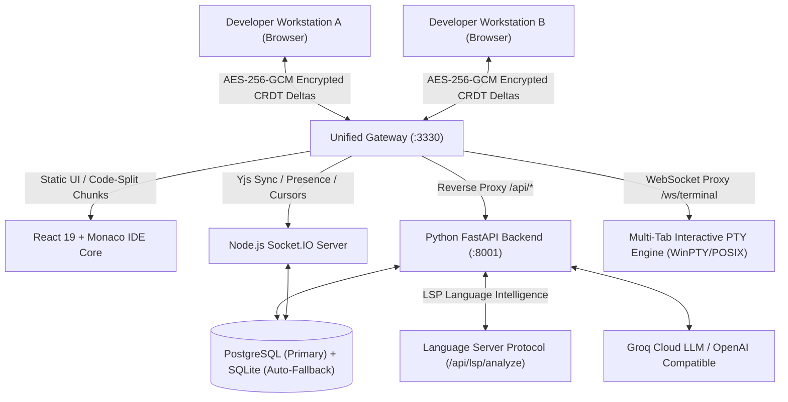

# Nulltor: Secure LAN Collaborative IDE & Version Control Platform
## Comprehensive Architectural Abstract & Technical Specification Document

---

## 1. Executive Summary & Vision

**Nulltor** is an enterprise-grade, peer-to-peer collaborative development environment and localized version control platform. It is designed to operate seamlessly over local area networks (LAN) or air-gapped enterprise environments. Nulltor fuses the real-time collaborative editing experience of **VS Code** with the branch governance, code reviews, and audit trails of **GitHub**, combined with an autonomous **AI Software Engineering Agent**.

Nulltor guarantees 100% data sovereignty and zero-trust security: code snapshots and CRDT synchronization deltas are encrypted client-side using military-grade cryptography (**AES-256-GCM**) before transmission, ensuring that the central gateway or host server remains completely blind to plain source code.

---

## 2. Comprehensive Feature Set

Nulltor provides a complete ecosystem for modern software development without relying on external cloud providers. 

### 🌟 Core Collaborative Features
- **Real-Time Code Synchronization**: Zero-latency collaborative editing powered by CRDTs (Conflict-free Replicated Data Types).
- **Live Peer Presence & Cursors**: See exactly what your teammates are typing, selecting, and viewing in real-time.
- **WebRTC Video & Audio Chat**: Native peer-to-peer mesh calling built directly into the IDE without third-party servers.
- **Zero-Trust Encryption (E2EE)**: Client-side AES-256-GCM encryption means the server never sees the raw code.

### 💻 Developer Experience (IDE)
- **Embedded Monaco Editor Core**: The exact same engine powering VS Code, customized with themes and syntax highlighting.
- **Language Server Protocol (LSP)**: Real-time syntax checking, linting, error squiggles, and contextual autocomplete for Python, JSON, C, C++, and more.
- **Multi-Tab Interactive Terminal**: Tabbed terminal manager supporting multiple native shell sessions (PowerShell/Bash) with ANSI support.
- **Code Execution Sandbox**: Instant execution of scripts (`.py`, `.js`, `.ts`, `.c`, `.cpp`, `.go`, `.rs`) directly from the IDE.
- **In-Browser Code Beautifier**: Instant formatting for JS, TS, JSON, CSS, HTML, Python, and C/C++ via `Shift + Alt + F`.
- **Dual-Engine Full-Text Search**: Instantly grep across the entire workspace or filter by filenames.
- **Live Diagnostics Status Bar**: Real-time connection status, error/warning counters, and cursor position tracking.

### 🛡️ Version Control & Branch Governance
- **GitHub-Style Branching**: Supports `main` (trunk), feature branches, and private developer vaults.
- **Pull Requests & Code Reviews**: Decentralized PR governance with line-by-line diff viewers and approval workflows.
- **Atomic Content-Addressed Storage (CAS)**: Git-like file snapshots and commit graphs.

### 🤖 AI Engineering Capabilities
- **AgentPanel (Autonomous Developer)**: A ReAct agent capable of reading/writing files and autonomous tool usage.
- **DevBot**: Embedded intelligent conversational assistant.
- **Inline Ghost-Text Autocomplete**: Copilot-style real-time code suggestions.

### 🧩 Ecosystem Integration
- **Live Open VSX Marketplace**: Install and manage real VS Code extensions directly from the open-source Eclipse VSX registry.

---

## 3. Technology Stack & Libraries Used

Nulltor is built on a highly optimized, modern technology stack spanning frontend, middleware, backend, and data layers.

### 🖥️ Frontend (Client Application)
- **Core Framework**: React 19 + TypeScript + Vite 6
- **Editor Engine**: `@monaco-editor/react` (v4.7.0)
- **CRDT & Sync**: `yjs` (v13.6.31)
- **Real-time Networking**: `socket.io-client` (v4.8.3)
- **Terminal Emulator**: `@xterm/xterm` (v6.0.0) + `@xterm/addon-fit`
- **Cryptography**: `@noble/ciphers` (v2.3.0), `@noble/hashes` (v2.3.0), `crypto-js` (v4.2.0)
- **State Management**: `zustand` (v5.0.14)
- **Routing**: `react-router-dom` (v7.18.2)
- **UI & Styling**: Vanilla CSS + `lucide-react` (icons) + `react-diff-view` (PR diffs) + `marked` (Markdown parsing)

### 🌉 Unified Gateway & Real-Time Server
- **Runtime**: Node.js + Express 5
- **WebSocket Engine**: Socket.IO (v4.8.3)
- **Reverse Proxy**: `http-proxy-middleware`
- **Local Network Discovery**: `multicast-dns` (mDNS for `nulltor.local` advertising)

### ⚙️ Backend API & AI Services
- **Web Framework**: Python FastAPI + Uvicorn (ASGI)
- **Database ORM**: SQLAlchemy 2.0 (Async) + Alembic (Migrations)
- **Security & Auth**: `python-jose` (JWT), `passlib[bcrypt]` (Password Hashing), `python-multipart`
- **Database Drivers**: `asyncpg` (PostgreSQL), `aiosqlite` (SQLite)
- **Terminal Integration**: `pywinpty` (Windows PTY) / native `pty` (POSIX)
- **Data Science / AI Libs**: `numpy`, `pandas`, `scipy`, `scikit-learn`, `tensorflow`, `beautifulsoup4`
- **HTTP Client**: `httpx`, `requests`

---

## 4. Data Backup, Storage & Reliability Architecture

Nulltor employs a highly resilient, hybrid database approach to ensure zero data loss and maximum availability across varying deployment scales.

### 4.1 Tri-Engine Storage System
Nulltor utilizes a **Tri-Engine Storage** pattern which automatically selects and falls back between database systems based on availability and load:
1. **PostgreSQL (Primary Tier)**: When deployed in enterprise environments (via Docker or custom URLs), Nulltor uses PostgreSQL as the primary high-concurrency database.
2. **SQLite (Auto-Fallback Tier)**: If PostgreSQL is unavailable, Nulltor automatically gracefully falls back to a localized SQLite database (`nulltor.db`) running in Write-Ahead Logging (WAL) mode (`PRAGMA journal_mode=WAL`), allowing concurrent readers and debounced writers.
3. **In-Memory Volatile Tier**: For transient socket state, cursor positions, and WebRTC signaling, data is managed entirely in-memory by the Node.js gateway.

### 4.2 Content-Addressed Storage (CAS)
Code persistence mimics Git's underlying architecture:
- **Append-Only Blobs**: Every saved file version is hashed (SHA-256) and stored as an immutable blob. 
- **Atomic CAS Sync**: When a Pull Request is approved, `encrypted_blobs`, `live_keyframes`, and `file_snapshots` are simultaneously committed across the database, preventing orphaned data during merge conflicts.

### 4.3 Automated Session Persistence
- **Synchronous `docRef` State Bridge**: Eliminates React state closure delay, ensuring all Monaco keystrokes write into the live Yjs document synchronously.
- **Debounced Snapshotting**: The system takes automatic idle snapshots of the CRDT structure every 2.5 seconds.
- **Auto-Save**: Automatic saves are triggered when switching file tabs, ensuring developers never lose uncommitted state if their browser crashes.

---

## 5. Security & Cryptography Implementations

- **Authentication & Cookies**: JWT refresh tokens are strictly stored as `HttpOnly`, `SameSite=Lax` cookies, neutralizing XSS token theft vectors.
- **Key Derivation (PBKDF2)**: 256-bit symmetric keys are derived via PBKDF2-HMAC-SHA256 using 100,000 iterations and dynamic, cryptographically secure 128-bit salts generated per project.
- **In-Memory Derived Key Caching**: Memoized session salts and an LRU key cache reduce keystroke encryption time to `<0.01ms` to guarantee zero typing latency.
- **Terminal WebSocket Guard**: The `/ws/terminal` endpoint enforces strict JWT cryptographic validation, instantly rejecting unauthorized interactive PTY connections.

---

## 6. System Execution Models & Portability

Nulltor is designed to be completely portable and distributable as a SaaS or localized appliance.

| Deployment Mode | Mechanism | Description |
| :--- | :--- | :--- |
| **Universal Local Startup** | `npm start` | Self-healing bootstrap: creates virtual env, installs dependencies, verifies frontend build, and starts FastAPI + Gateway on a unified port (`:3330`). |
| **Enterprise Docker Stack** | `docker compose up --build` | Launches containerized Gateway + FastAPI + PostgreSQL. Easily deployable to AWS, Azure, or on-premise Kubernetes clusters. |
| **mDNS Zero-Config** | `nulltor.local:3330` | The Node.js gateway automatically advertises the service via multicast DNS, allowing users on the same Wi-Fi to connect instantly without knowing IP addresses. |

---

## 7. Future Roadmap

1. **Dedicated SFU / Mesh Scalability (WebRTC)**: Upgrading from peer-to-peer WebRTC to a Selective Forwarding Unit (SFU) like mediasoup to support 20+ participant video rooms.
2. **Interactive Commit DAG Network Graph**: Visual SVG/Canvas commit network graph showing branch divergence and merge ancestry.
3. **CAS Garbage Collection**: Automated garbage collection and orphaned blob pruning pipelines to optimize long-term database storage sizes.
